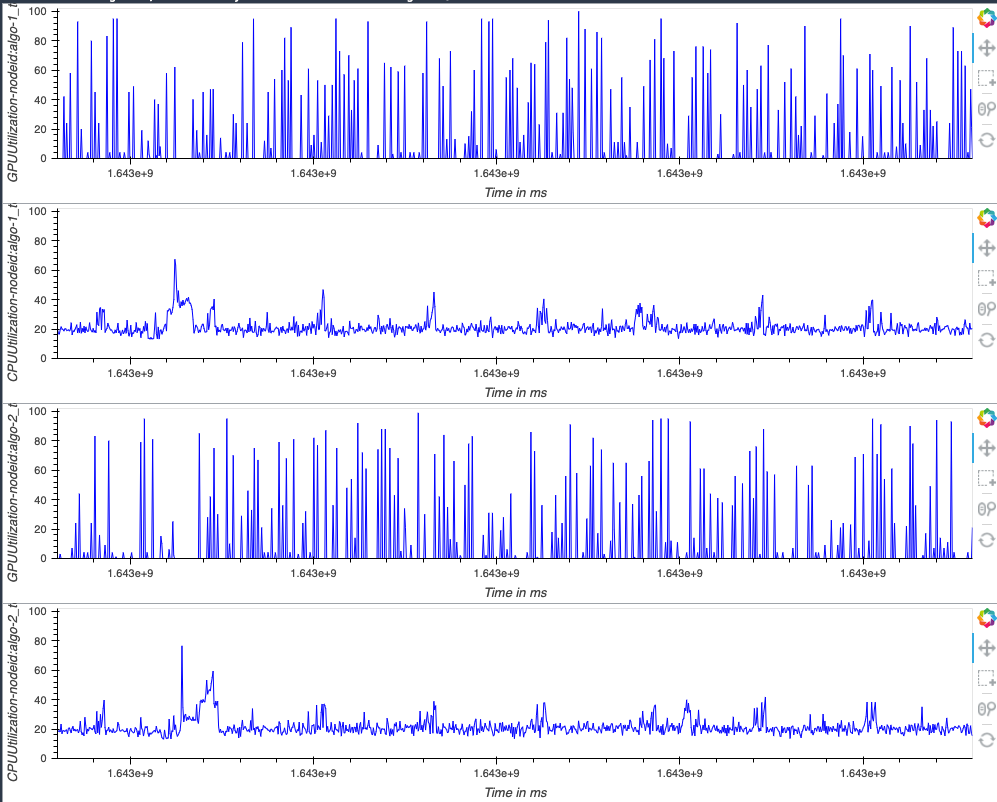

# Dog Breed Classification using AWS SageMaker

This project leverages Sagemaker's tools to perform training, hyperparameter optimization, debugging, profiling, deployment and inference, applied to a computer vision classification problem (dog breed classifier based on pictures).

Tasks performed:
- Data setup
- Developing the model
- Train model with several hyperparam combinations to find the best (HPO)
- Retrain with the best hyperparams and Debugging/Profiling enabled 
- Generate a profiling report
- Deploy the model to an endpoint
- Perform inference by querying the endpoint

Please follow the `train-and-deploy.ipynb` notebook to check this flow step by step.

## Project Set Up and Installation
Create a bucket to store the training data.   
Enter Sagemaker Studio and open the notebook `train-and-deploy.ipynb`. Replace `edgarin-mlend` bucket name with the desired bucket's.  
Run the cells in order. (You might need to replace training job and endpoint names with your own).

*A Sagemaker Notebook instance will also work.

### Project files
You'll find the following project files:
- `README.md`: This file, general documentation
- `train-and-deploy.ipynb`: Main project file. Notebook that executes all the flow
- `hpo.py`: Model definition and training code, will be run multiple times during HPO step
- `train_model.py`: Very similar to `hpo.py`, but enhanced with debugging and profiling hooks
- `inference.py`: Code used to load the model and transform data during inference with the endpoint
- `Profile-output/`: Folder with the profiling/debugging reports

## Dataset

[This dataset](https://s3-us-west-1.amazonaws.com/udacity-aind/dog-project/dogImages.zip) consists of dog images of 133 different breeds, split in train, test and validation sets, following the following file structure:
- train/
  - breed1/
    - some-dog.jpg
    - another-dog.jpg
  - breed2/
    - cutie-dog.jpg  
    ...
  - breed133/  
    ...  
- test/  
   (same structure as train)
- valid/  
   (same structure as train)

For example, some-dog.jpg is a dog picture of breed1.

## Hyperparameter Tuning
### Model
The base chosen model was [DenseNet121](https://iq.opengenus.org/architecture-of-densenet121/). It's suitable for image classification.

To take advantage of transfer learning, the last layer was replaced by a custom classifier (check `hpo.py` for details).

### HPO
For hyperparameter tuning, we chose the following params:
- Batch size: 128 or 256
- Learning rate: Between 0.001 and 0.1 (continous): 
- Epochs: Between 2 and 5

Our target is to maximize **accuracy**


## Debugging and Profiling
Debugging was made with Sagemaker Debugger using the following rules:
- Overtrain
- Poor weight initalization
However, the most important step was to add the debugging hook **to track the loss progress**.
By plotting this data, we were able to check the evolution of the train and test losses during the training process:
  

For profiling, these rules were chosen:
- Low GPU Utilization
- ProfilerReport

As expected, the GPU utilization was higher than the CPU's: 


Check the generated debugging/profiling repo in `Profiler-output/` folder.


It was interesting noting that the GPU spent more time on the dataloading than performing convolutional operations:


## Model Deployment

The best model was deployed with the sagemaker sdk. It needed the companion `inference.py` script for the following tasks:
- Load model from artifact file to memory
- Perform in-out data transformations during inference

The endpoint expects a binary image and returns a JSON with the log softmax probabilites for the breeds, being the maximum one the predicted breed.

Sample code to query the endpoint (having the predictor):
```python
import io
import requests

image_url = "https://as2.ftcdn.net/v2/jpg/dog97C.jpg"
img_content = requests.get(image_url).content

pred = predictor.predict(img_content, initial_args={"ContentType": "image/jpeg"})
breed = torch.tensor(pred).argmax().item()
print('Inferred breed index is', breed)
```


