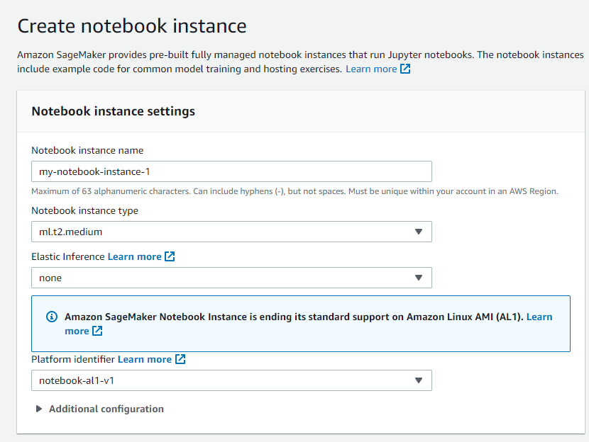
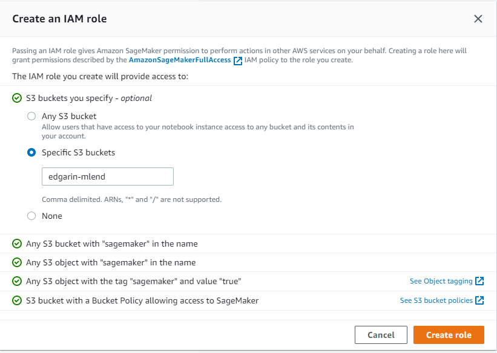
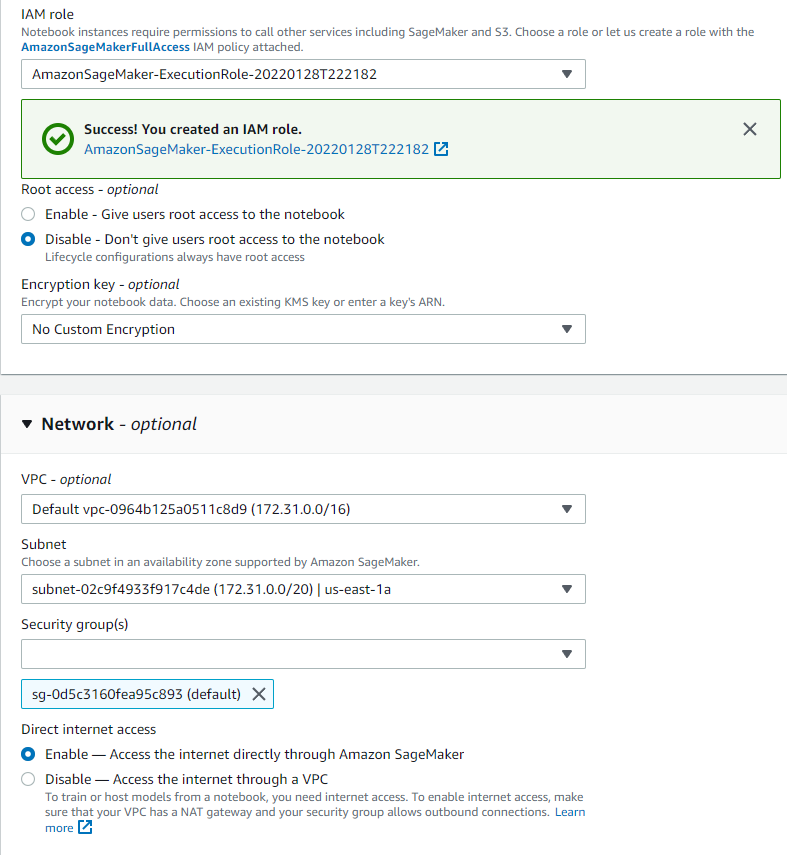

# Operationalizing a Machine Learning Project

## Notebook instance creation

We chose a ml.t2.medium instance type. This is because the actual notebook performs light operations and we don't need more power. 
The delegated instances perform the heavy workload, but we'll see that later. 

Then, we create a new role. We only need the notebook to access to the `edgarin-mlend` bucket, so we configure the new role that way:

Next step is to configure the other security settings. 
This includes
- Selecting the newly created role
- Disable root access to the notebook
- Select a specific vpc, subnet and security group

We also created a bucket to store the training data and the artifacts (the aforementioned `edgarin-mlend` bucket).

## Training and Endpoint deployment
All the process is performed in the `train-and-deploy.ipynb` notebook. 
In a nutshell, it does the following
- Data setup
- Training and HPO
- Best model deployment

After all this is done, the endpoint is deployed

