# Operationalizing a Machine Learning Project

## Notebook instance creation

We chose a ml.t2.medium instance type. This is because the actual notebook performs light operations and we don't need more power. 
The delegated instances perform the heavy workload, but we'll see that later. 

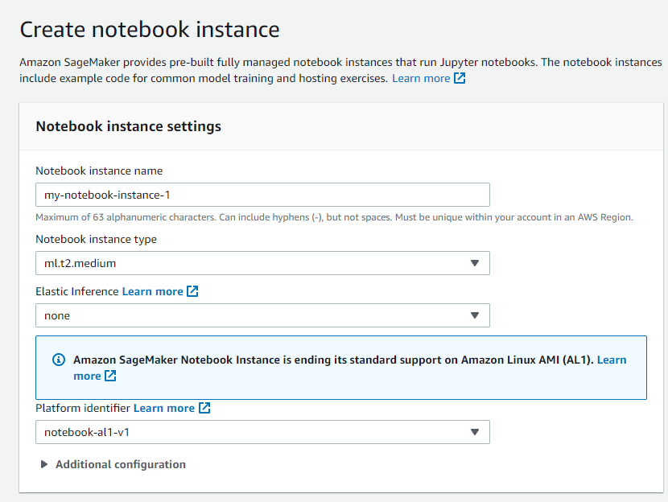

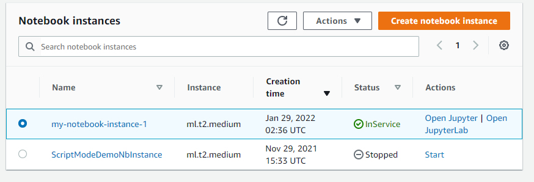

Then, we create a new role. We only need the notebook to access to the `edgarin-mlend` bucket, so we configure the new role that way:

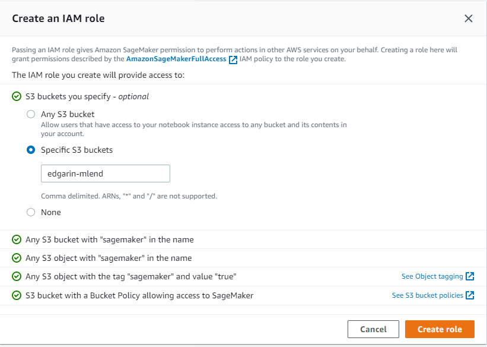

Next step is to configure the other security settings. 
This includes
- Selecting the newly created role
- Disable root access to the notebook
- Select a specific vpc, subnet and security group

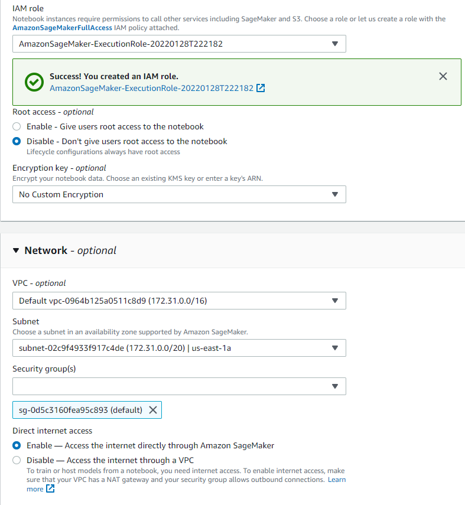

We also created a bucket to store the training data and the artifacts (the aforementioned `edgarin-mlend` bucket).

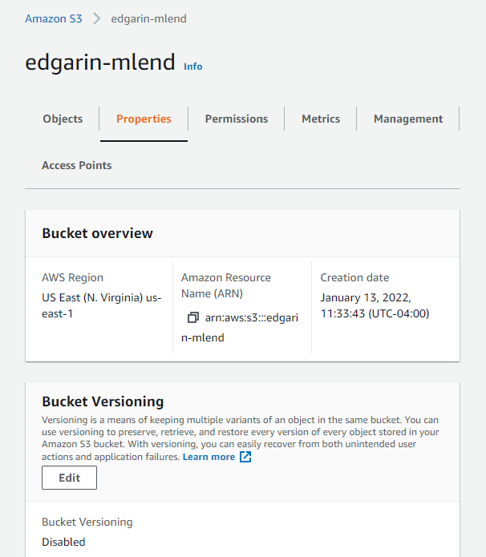

## Training and Endpoint deployment
All the process is performed in the `train-and-deploy.ipynb` notebook. 
In a nutshell, it does the following
- Data setup
- Training and HPO
- Best model deployment

After all this is done, the endpoint is deployed

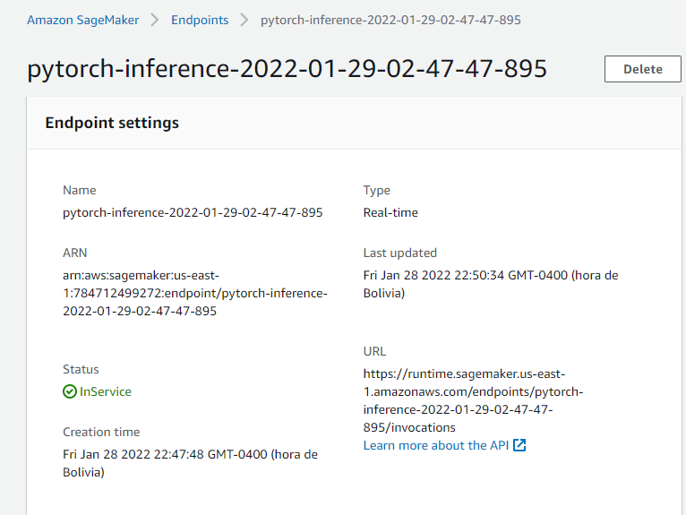

## Training on EC2 instance
The choice is an `ml.m5.xlarge` instance to be able to train in a reasonable amount of time without much cost. 
It has 4 CPUs and 16GB of RAM, which is very suitable for our usecase 

Given this will be a 1 time run, a spot instance was chosen to save money.

This instance type doesn't support CUDA, because our code didn't need it, Otherwise, we would have chosen a `p2.xlarge` instance (cheapest with good GPU).


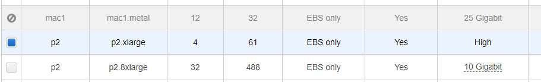

For the security group, we chose to access it only from my ip with a keypair (ssh)

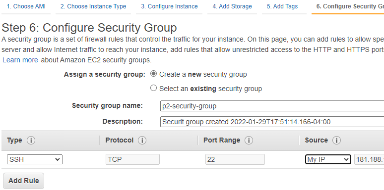

Then, training is triggered via ssh

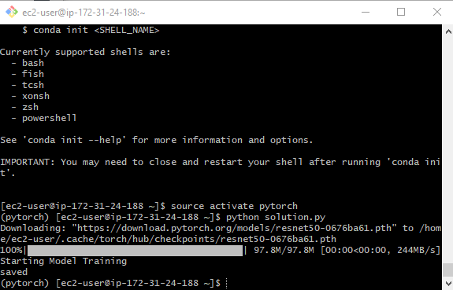

This creates a model artifact in TrainedModels/model.pth

This script (`ec2train1.py`) is essentially the same as the one trained in script mode (`hpo.py`) with the following minor differences:
- `hpo.py` does have logging
- `hpo.py` is parameterized by command line or env vars (learning rate, batch size, file locations), whereas `ec2train1.py` has them hardcoded
In fact, we could use `hpo.py` for both purposes, as long as we send the params when calling it.

## Endpoint invocation from Lambda
We create a lambda function that will basically take a dog image URL and will invoke the deployed endpoint to perform the prediction.
It uses boto3's `invoke_endpoint` api, sending a json with the image url.
Let's keep in mind that behind the scenes, the `inference2.py` script will transform this url to a binary image that the endpoint can process.

Finally, the prediction -as defined in the training script- is an array of log probabilities for all breeds:

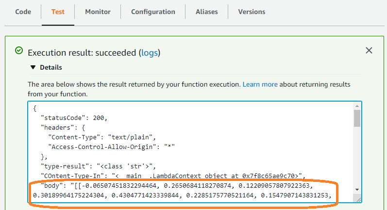

Full response: 
```
{
  "statusCode": 200,
  "headers": {
    "Content-Type": "text/plain",
    "Access-Control-Allow-Origin": "*"
  },
  "type-result": "<class 'str'>",
  "COntent-Type-In": "<__main__.LambdaContext object at 0x7f9494aafc70>",
  "body": "[[-2.086071729660034, -0.4096687436103821, 0.10018402338027954, -0.560416042804718, 0.8676022291183472, -1.01795494556427, -0.696791410446167, 0.32929039001464844, -1.2479321956634521, 0.020815277472138405, 0.6166585087776184, 0.5361841320991516, -0.980082631111145, 1.8472927808761597, -0.8249684572219849, -0.4432758688926697, -0.11257901787757874, 0.06838889420032501, -0.3468268811702728, 0.7498425245285034, 0.4805867373943329, 0.43451595306396484, -0.6427516341209412, -2.1748838424682617, -0.33268147706985474, -1.048490285873413, -0.548957884311676, 0.1784212738275528, 0.062015287578105927, 0.6506719589233398, -0.23455460369586945, 0.6995708346366882, -1.3956083059310913, -0.29738444089889526, -1.4377977848052979, -0.0949321836233139, -0.9140621423721313, 0.12595368921756744, 1.2304781675338745, 0.2627008259296417, 0.7445471882820129, 0.6374397277832031, 0.07275211811065674, 0.03581000119447708, 0.14272506535053253, -1.9425201416015625, -0.8819517493247986, -0.14341771602630615, 0.22057566046714783, -0.18193764984607697, -0.4362776279449463, -1.513752818107605, -1.5139929056167603, 0.4629129469394684, -1.8176488876342773, -0.5190005898475647, -2.181206226348877, 0.17188036441802979, -0.9624494314193726, -0.8258651494979858, -0.7915470600128174, -0.7831217050552368, -0.8746958374977112, -2.8129680156707764, -0.03756184130907059, -1.479920506477356, -1.2080261707305908, -0.10609769076108932, 0.45808446407318115, 0.5836431980133057, 1.5054337978363037, -0.19601209461688995, -1.190253734588623, -1.3044371604919434, -0.8454561829566956, -0.785483181476593, -0.7188765406608582, -1.0338568687438965, -0.8108982443809509, -1.3426909446716309, 0.5842368006706238, -1.3853827714920044, -0.1665971875190735, 0.024822715669870377, -1.616932988166809, -1.328690767288208, 0.5667872428894043, -0.6165443062782288, 0.11018984019756317, 0.3926028907299042, -1.4719825983047485, -0.3472040593624115, -2.110527276992798, -1.2755346298217773, -1.4138422012329102, 0.14893333613872528, -1.4475703239440918, -0.30800241231918335, -1.473775029182434, -1.1532443761825562, -1.2875094413757324, -0.8070265054702759, 0.13334234058856964, -0.22911319136619568, -0.6077209115028381, -0.7970536351203918, -0.649531364440918, -0.5021648406982422, 0.6992360949516296, 0.02688320353627205, -0.34318411350250244, -0.7525550127029419, -1.4222548007965088, -0.39927980303764343, -1.3813648223876953, -0.5634161233901978, -0.23663754761219025, 1.168677806854248, -1.9542970657348633, 0.7075570225715637, -0.8366976380348206, -1.1338938474655151, -0.6901345252990723, -1.3234493732452393, -1.6439228057861328, -1.5084632635116577, -1.41220223903656, -0.5333788394927979, -0.16015617549419403, -0.4848351776599884, -1.7316231727600098, -0.47715944051742554, -1.8218567371368408]]"
}
```

### About Lambda's security
Before executing the lambda, function, its execution role needs permisions to invoke the endpoint. So, a role with AWSSagemakerFullAccess policy was created:

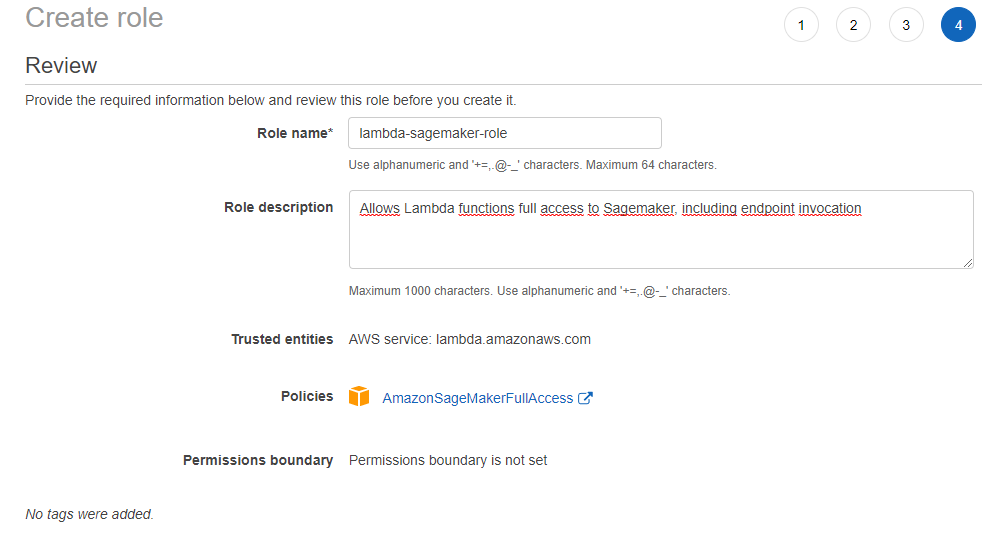

And then of course the role is attached to the lambda function.

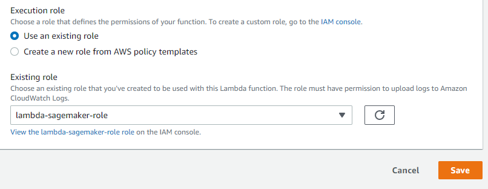

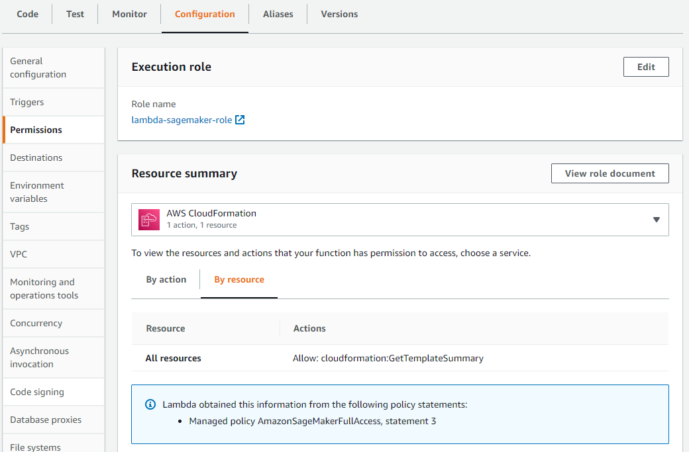

In a real life scenario, it's strongly suggested to apply the least privilege principle. According to this, we would create a role with only permissions to invoke the lambda, but not full sagemaker access.

On the other hand, it's very important to configure resource based policies to define who specifically can execute the lambda function.
For instance, if it's through API gateway, restrict the permissions to this service (and also configuring the correct authentication/authorization permissions in the api itself, but that's another story). 

Finally, adding the lambda to a VPC needs to be considered, if applicable. 

## Concurrency
We setup concurrency/autoscaling for both the lambda function and the endpoint

For lambda, we reserved 3 instances and also provisioned concurrency of 2 always-on with the possibility to scale to a 3rd instance.

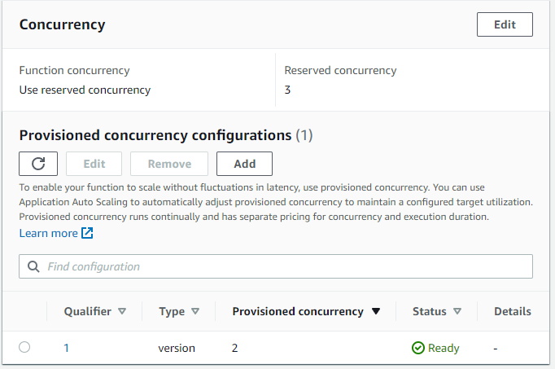

For the endpoint, we configured autoscaling with a minimum of 2 and maximum of 3 instances

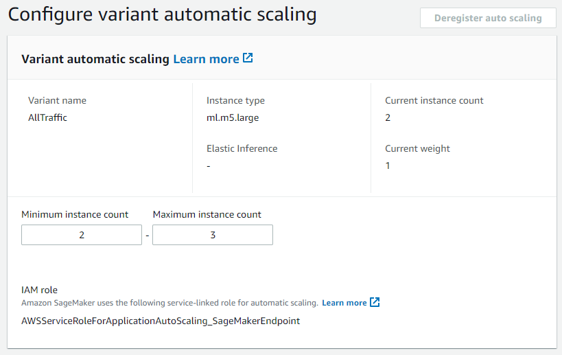

Also, we want to spin up instances when there are 5 or more simultaneous requests 
(Typo: Screenshot shows 2 as target value but the final config was actually 5)

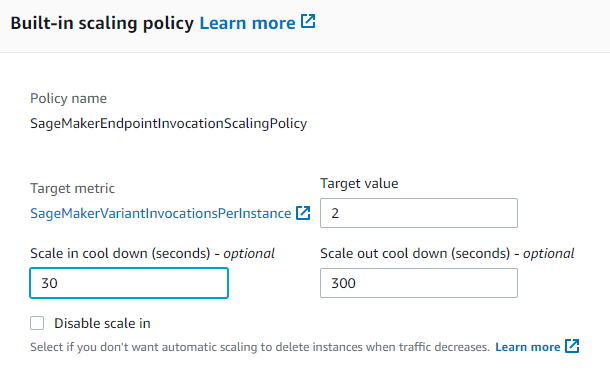

Summarizing, we chose autoscaling of minimum 2 and maximum 3 instances for both lambda and endpoint.
This is because due to our synchronous design, we can expect a 1-1 correspondence here. 1 lambda will derive the request to 1 endpoint.  

However, if we had an async design, we could have many more lambdas to attend the requests, queue them and then have less endpoints
to make the inferences as they get free.


